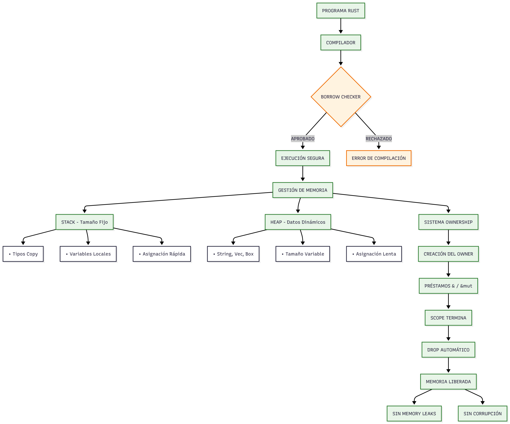

Integrantes: Beltrán Yeimy, Suárez Marc y Poveda Alejandro.
# PARTE 1 – Modelo de Memoria

Actividad 1: Representación Visual de Memoria 

Sustentación del punto:
El código Rust de esta adjunto en esta carpeta llamado punto1.rs demuestra el modelo de memoria mediante el sistema de ownership que controla quién accede a los datos, donde valores con tamaño fijo se asignan en el stack y los dinámicos en el heap mediante tipos como String, liberándose automáticamente al salir del scope gracias al trait Drop, mientras el borrow checker previene errores como use-after-free o data races en tiempo de compilación mediante reglas estrictas de préstamos (& inmutables vs &mut exclusivos), garantizando así seguridad de memoria sin necesidad de un garbage collector y evitando corrupción mediante verificación estática que rechuta código inseguro antes de su ejecución.
