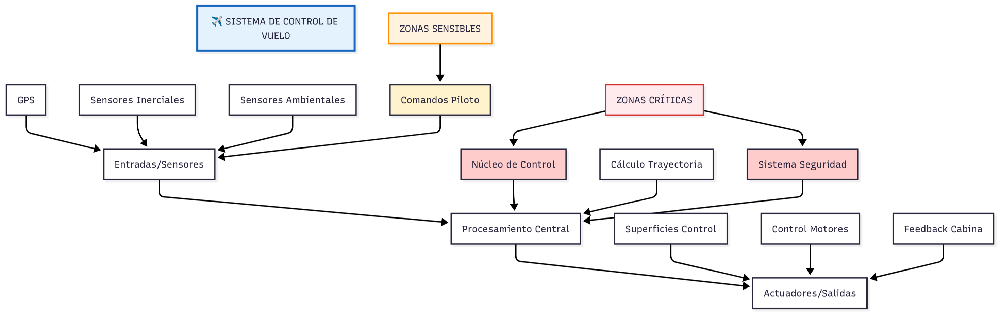

# PARTE 3 – Arquitectura Conceptual

Actividad 3: Diseña una mini arquitectura

Sustentación del punto: EL codigo rust que esta adjunto a esta carpeta llamado punto3.rs sustenta el diagrama de arquitectura al implementar fielmente los tres componentes principales: las entradas se representan mediante el struct Sensores que encapsula datos del GPS, sensores inerciales y comandos del piloto; el procesamiento central se materializa en las funciones calcular_comandos() para el núcleo de control, verificar_seguridad() para el sistema de protección y calcular_trayectoria() para la navegación, reflejando las zonas críticas y sensibles del diagrama; finalmente, los actuadores se concretan en el struct Actuadores que ejecuta los comandos físicos. El flujo secuencial en main() replica exactamente el camino de datos del diagrama, demostrando cómo Rust garantiza seguridad mediante verificación en compilación para las operaciones críticas de vuelo.
